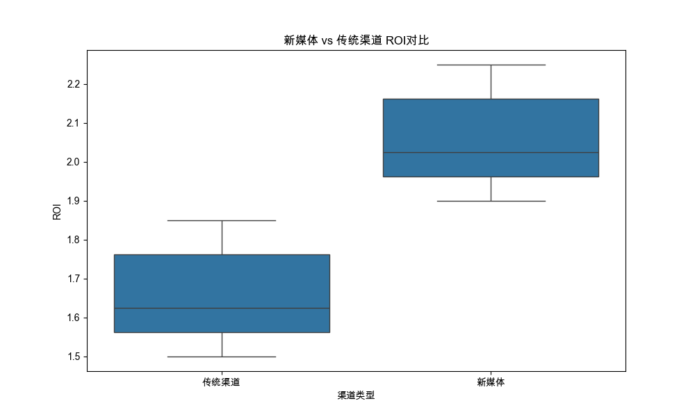
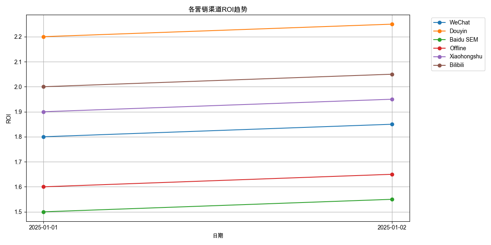
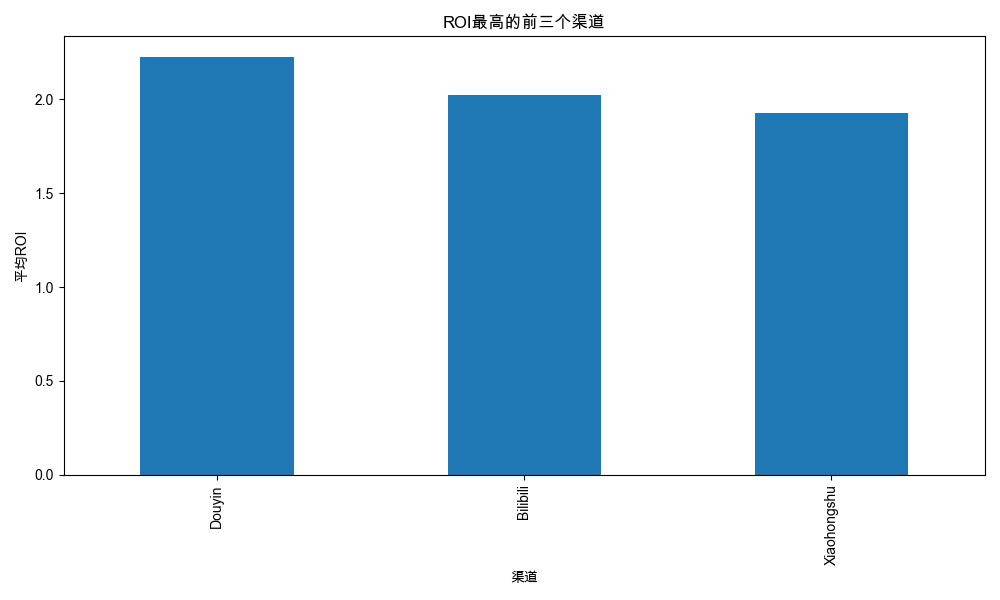

# 营销渠道ROI分析报告

## 1. 新媒体vs传统渠道对比

- 新媒体平均ROI: 205.83%
- 传统渠道平均ROI: 165.83%
- 差异分析: 新媒体渠道的ROI 高于传统渠道

## 2. ROI趋势分析

## 3. 表现最佳的前三个渠道

1. Douyin: 222.50%
2. Bilibili: 202.50%
3. Xiaohongshu: 192.50%

## 4. 优化建议
1. 加大新媒体投入
2. 重点关注Douyin和Bilibili的成功经验
3. 考虑调整投资组合，将更多资源分配给高ROI渠道
4. 定期监控ROI变化，及时调整营销策略

## 5. 风险提示
- 需要综合考虑渠道的用户质量和长期价值
- 建议进行A/B测试验证优化方案
- 关注竞品动向，保持竞争优势
