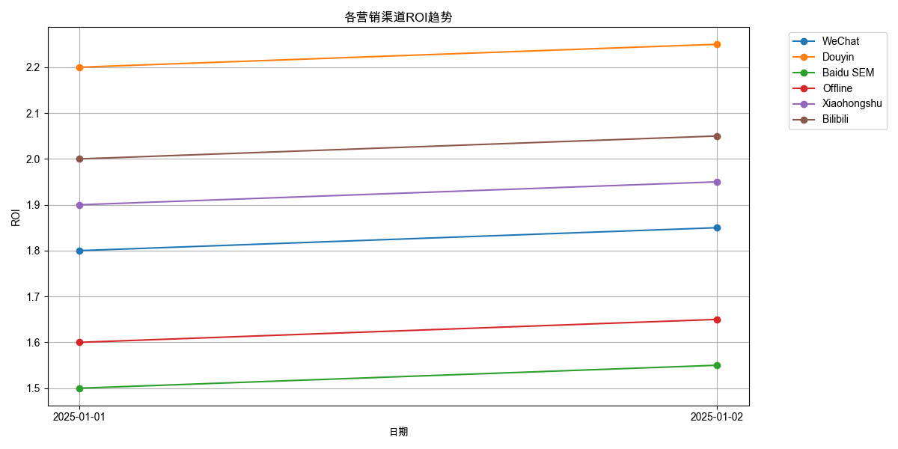
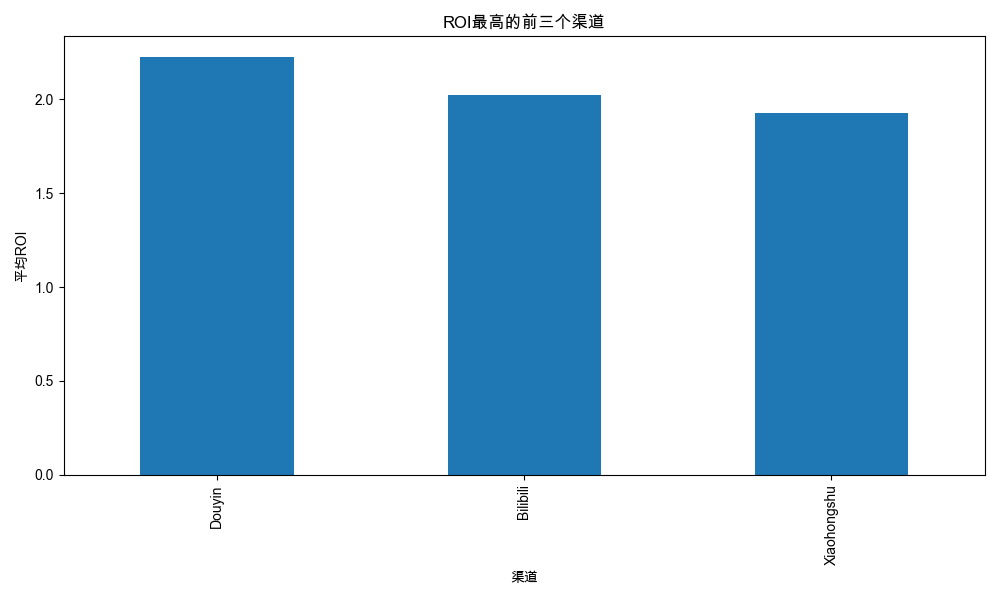

# 解码新媒体营销：AI驱动的ROI深度分析
## PPT演示脚本

### 第一部分：开场引入（2分钟）
#### 封面页
- 标题：《解码新媒体营销：AI驱动的ROI深度分析》
- 副标题：AI赋能数据分析新范式
- 演讲者信息

#### 引言页
- 开场语：「在数字化营销的时代，如何精准评估投资回报，实现精细化运营？让我们用AI的视角，来解码新媒体营销的奥秘。」
- 核心议题：
  * 新媒体营销效能评估
  * AI驱动的数据分析方法
  * 精准投资决策建议

### 第二部分：数据洞察（5分钟）
#### 新媒体vs传统渠道对比

- 关键发现：
  * 新媒体平均ROI 205.83%
  * 传统渠道平均ROI 165.83%
  * 数据支撑的优势论证

#### ROI趋势分析

- 趋势解读：
  * 各渠道ROI时间变化
  * 波动规律分析
  * 关键时点解释

#### 最佳渠道TOP3

- 核心数据：
  * 抖音：222.50%
  * B站：202.50%
  * 小红书：192.50%

### 第三部分：策略建议（3分钟）
#### 优化方向
1. 新媒体投资策略
   - 加大投入建议
   - 资源优化配置
   - 效果评估机制

2. 渠道协同策略
   - 多渠道整合
   - 内容差异化
   - 目标人群定位

#### 风险控制
- 质量监控
- A/B测试
- 竞品分析

### 第四部分：AI赋能亮点（2分钟）
#### AI分析优势
- 快速数据处理
- 多维度分析
- 实时优化建议

#### 创新应用
- 智能预测
- 自动报告
- 决策支持

### 结束页
- 总结：「AI不仅帮助我们看见数据，更帮助我们看懂数据，让营销决策更智慧、更精准。」
- 下一步行动建议
- 问答环节预留

### 设计建议
1. 配色方案：
   - 主色：科技蓝
   - 辅助色：数据图表对比色
   - 强调色：关键数据红色

2. 版式设计：
   - 简约现代
   - 数据可视化为主
   - 留白充足

3. 动效建议：
   - 数据渐进展示
   - 图表动态生成
   - 重点标注动画

### 注意事项
1. 演示重点：
   - 突出AI分析优势
   - 强调数据价值
   - 展示实用建议

2. 互动设计：
   - 预设问题环节
   - 案例分享
   - 现场分析演示

3. 时间控制：
   - 预留QA时间
   - 关键点重复
   - 节奏把控

---
注：这是新媒体营销ROI分析的演示模块，后续可以继续补充其他分析模块，如：
- 用户行为分析
- 内容效果分析
- 竞品对标分析
- 预算优化分析
等
